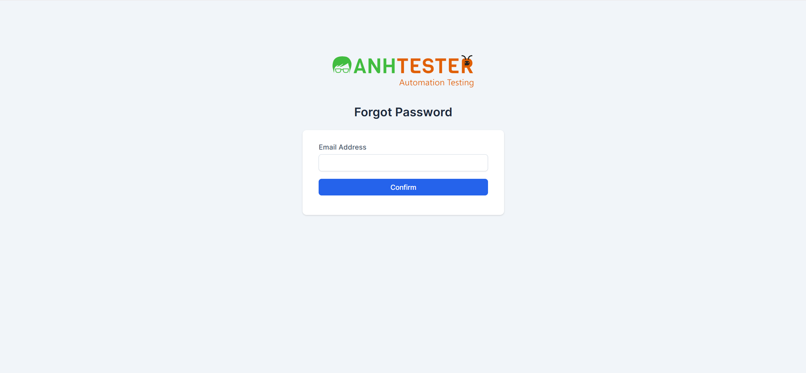

# KAN-1: Khôi phục mật khẩu (Forgot Password)

| Thuộc tính | Giá trị |
|---|---|
| **Issue Key** | KAN-1 |
| **Loại** | Story |
| **Trạng thái** | To Do |
| **Độ ưu tiên** | High |
| **Người giao** | Unassigned |
| **Người báo** | Người Tình Quê |
| **Labels** | N/A |
| **Components** | N/A |
| **Attachments** | 1 file(s) |
| **Ngày tạo** | 2026-04-03T04:31:11.181+0700 |
| **Cập nhật** | 2026-04-03T05:42:46.556+0700 |

## Mô tả (Description)

Là một người dùng quên mật khẩu, tôi muốn yêu cầu gửi email khôi phục để lấy lại quyền truy cập.

Acceptance Criteria:

| ID | Tiêu chí chấp nhận |
| --- | --- |
| AC-08 | Click "Forgot Password?" -> chuyển đến /admin/authentication/forgot_password |
| AC-09 | Nhập email hợp lệ + click "Confirm" -> hệ thống gửi email khôi phục |
| AC-10 | Để trống Email + click "Confirm" -> trình duyệt cảnh báo HTML5 (trường có required) |

### Trang Forgot Password

| Tên trường | Loại UI | HTML Type | Bắt buộc | ID | Name | Ghi chú |
| --- | --- | --- | --- | --- | --- | --- |
| Email Address | Textbox | email | Có | email | email | Có thuộc tính "required" (client-side) |
| Confirm | Button | submit | N/A | N/A | N/A | Class: btn btn-primary btn-block |

### Khôi phục mật khẩu

1. Click "Forgot Password?" từ trang Login

2. Chuyển đến /admin/authentication/forgot_password

3. Nhập Email đã đăng ký

4. Click "Confirm"

5. Hệ thống gửi email hướng dẫn đặt lại mật khẩu

## Attachments (1 file)

| # | Filename | Type | Size |
|---|----------|------|------|
| 1 | [2026-04-03_04-28-27.png](2026-04-03_04-28-27.png) | image/png | 62.8 KB |  
