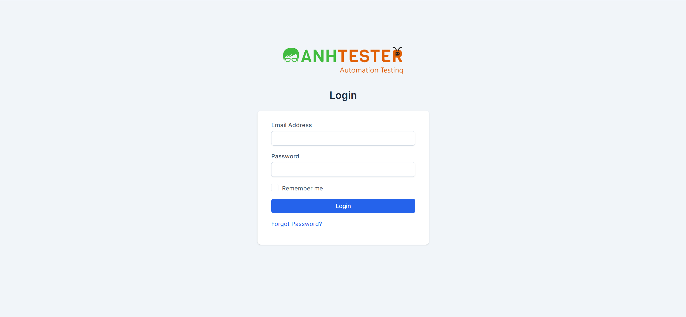
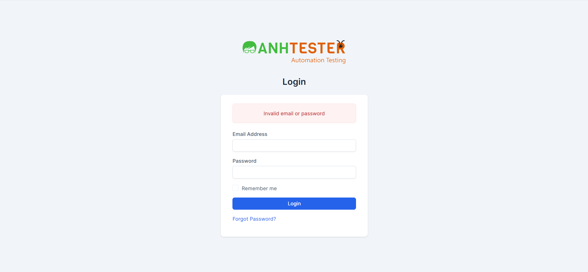

# KAN-4: Tính năng Đăng nhập (Login)

| Thuộc tính | Giá trị |
|---|---|
| **Issue Key** | KAN-4 |
| **Loại** | Task |
| **Trạng thái** | To Do |
| **Độ ưu tiên** | High |
| **Người giao** | Unassigned |
| **Người báo** | Người Tình Quê |
| **Labels** | N/A |
| **Components** | N/A |
| **Attachments** | 2 file(s) |
| **Ngày tạo** | 2026-04-03T05:27:19.618+0700 |
| **Cập nhật** | 2026-04-03T05:42:32.970+0700 |

## Mô tả (Description)

Là một người dùng, tôi muốn đăng nhập bằng email và mật khẩu để truy cập trang quản trị CRM.

### Acceptance Criteria (Tiêu chí chấp nhận):

|   |   |
| --- | --- |
| AC-01 | Nhập đúng Email và Password, click Login -> chuyển hướng đến Dashboard (/admin/) |
| AC-02 | Để trống Email -> thông báo "The Email Address field is required." |
| AC-03 | Để trống Password -> thông báo "The Password field is required." |
| AC-04 | Để trống cả hai trường -> hiển thị đồng thời cả hai thông báo AC-02 và AC-03 |
| AC-05 | Email sai định dạng (thiếu @) -> trình duyệt hiển thị cảnh báo HTML5 validation |
| AC-06 | Email/password sai -> thông báo "Invalid email or password" |
| AC-07 | Tick "Remember me" + đăng nhập thành công -> phiên được duy trì sau khi đóng trình duyệt |

### Trang Login

| Tên trường | Loại UI | HTML Type | Bắt buộc | ID | Name | Ghi chú |
| --- | --- | --- | --- | --- | --- | --- |
| Email Address | Textbox | email | Có (*) | email | email | Server-side validation + HTML5 email format. Class: form-control |
| Password | Textbox (masked) | password | Có (*) | password | password | Hiển thị dạng masked. Class: form-control |
| Remember me | Checkbox | checkbox | Không | remember | remember | Mặc định: không tick. Value = "estimate" |
| Login | Button | submit | N/A | N/A | N/A | Class: btn btn-primary btn-block |
| Forgot Password? | Link | anchor | N/A | N/A | N/A | Chuyển đến trang forgot_password |
| csrf_token_name | Hidden | hidden | N/A | N/A | csrf_token_name | CSRF token tự động sinh bởi server |

(*) Không có thuộc tính "required" trên HTML, nhưng server-side validation kiểm tra và trả lỗi nếu để trống.

## LUỒNG XỬ LÝ

### 1. Đăng nhập thành công (Happy Path)

1. Truy cập https://crm.anhtester.com/admin/authentication

2. Trang Login hiển thị form: Email, Password, Remember me, nút Login, link Forgot Password

3. Nhập Email hợp lệ (vd: [admin@example.com](mailto:admin@example.com))

4. Nhập Password đúng (vd: 123456)

5. (Tùy chọn) Tick "Remember me"

6. Click "Login"

7. Xác thực thành công -> chuyển hướng đến Dashboard (https://crm.anhtester.com/admin/ )

8. Trang Dashboard hiển thị với tiêu đề "Dashboard"

### 2. Thất bại - Để trống tất cả trường

1. Truy cập trang Login

2. Không nhập gì, click "Login"

3. Hiển thị 2 thông báo lỗi server-side: "The Email Address field is required." và "The Password field is required."

4. Thông báo trong `
`

5. Vẫn ở lại trang Login

### 3. Thất bại - Để trống Email

1. Để trống Email, nhập Password bất kỳ

2. Click "Login"

3. Thông báo: "The Email Address field is required."

### 4. Thất bại - Để trống Password

1. Nhập Email hợp lệ, để trống Password

2. Click "Login"

3. Thông báo: "The Password field is required."

### 5. Thất bại - Email sai định dạng

1. Nhập Email không có @ (vd: "invalidemail")

2. Click "Login"

3. Trình duyệt chặn form, hiển thị HTML5 tooltip: "Please include an '@' in the email address."

4. Đây là client-side validation, không phải server-side

### 6. Thất bại - Sai tài khoản/mật khẩu

1. Nhập Email hợp lệ nhưng sai (vd: [wrong@example.com](mailto:wrong@example.com)) + Password bất kỳ

2. Click "Login"

3. Thông báo server-side: "Invalid email or password"

4. Thông báo chung, không tiết lộ email sai hay password sai (thiết kế bảo mật)

## Attachments (2 file)

| # | Filename | Type | Size |
|---|----------|------|------|
| 1 | [2026-04-03_04-28-19.png](2026-04-03_04-28-19.png) | image/png | 67.9 KB |  
| 2 | [2026-04-03_04-28-57.png](2026-04-03_04-28-57.png) | image/png | 73.1 KB |  
