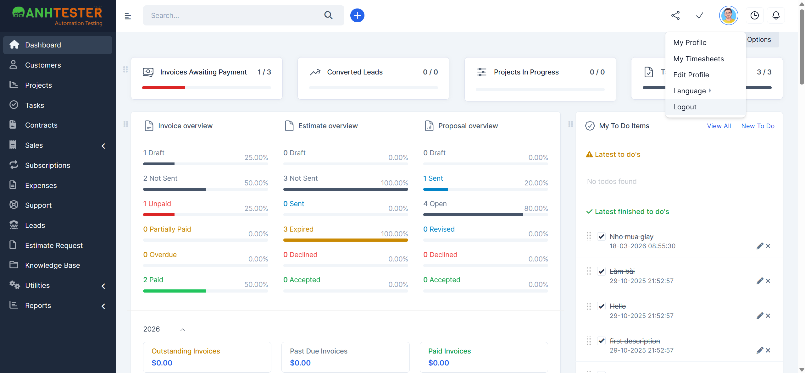
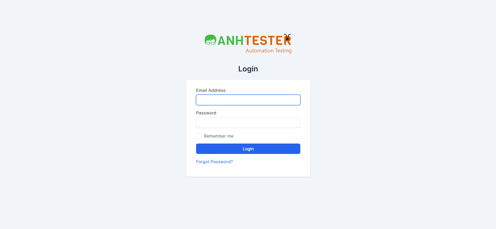

# KAN-6: Tính năng Đăng xuất (Logout)

| Thuộc tính | Giá trị |
|---|---|
| **Issue Key** | KAN-6 |
| **Loại** | Story |
| **Trạng thái** | To Do |
| **Độ ưu tiên** | High |
| **Người giao** | Unassigned |
| **Người báo** | Người Tình Quê |
| **Labels** | N/A |
| **Components** | N/A |
| **Attachments** | 2 file(s) |
| **Ngày tạo** | 2026-04-03T05:59:45.483+0700 |
| **Cập nhật** | 2026-04-03T05:59:48.783+0700 |

## Mô tả (Description)

Chức năng cho phép người dùng thoát phiên làm việc.

### Acceptance Criteria:

| ID | Tiêu chí chấp nhận |
| --- | --- |
| AC-11 | Từ Dashboard, click profile dropdown -> chọn Logout -> chuyển về trang Login |

## Attachments (2 file)

| # | Filename | Type | Size |
|---|----------|------|------|
| 1 | [2026-04-03_05-58-08.png](2026-04-03_05-58-08.png) | image/png | 278.3 KB |  
| 2 | [2026-04-03_05-58-23.png](2026-04-03_05-58-23.png) | image/png | 69.6 KB |  
